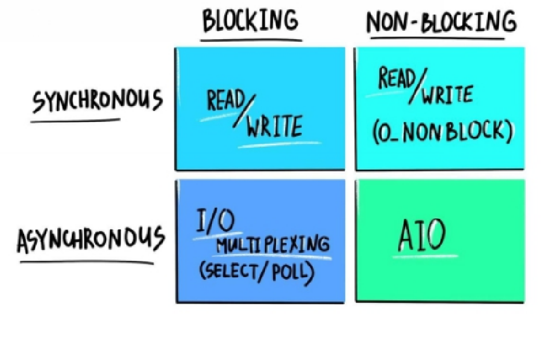
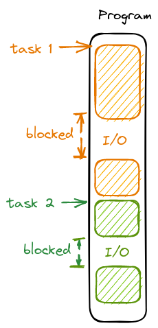
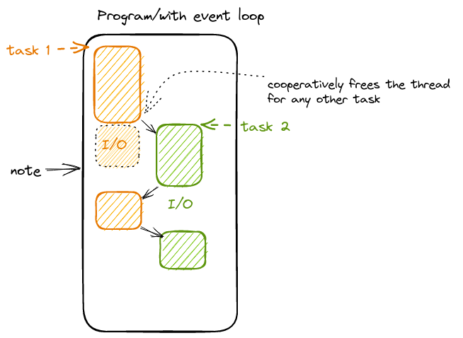
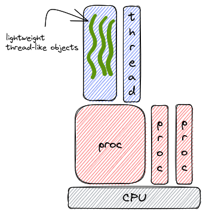

# 🕹️ I/O Models 

🎤🎤 Most CS challenges are actually boring !!.

## What is an I/O operation?
Well, any code running on a modern CPU is either executing normal instructions (arithmetic operations, moving around memory, etc) or an I/O instruction which is to communicate with external (off-cpu) peripherals like Network interfaces, USB controllers, etc. This communication is much slower than other operations and it's often done through buffers in order for other device interfaces to keep up with the CPU. So these instructions are inherently slow, hence the existence of more than one model to do I/O.

## What are its different types?
There are two ways to organize I/O: __Blocking__ and __NON-Blocking__, and there are two types of I/O: __Synchronous__ and __Asynchronous__. Mixing these attributes results in the 4 types of I/O models. The next Image shows the different I/O models. 

     
     

     <small>Adapted from <a href="https://luminousmen.com/post/asynchronous-programming-blocking-and-non-blocking" target="_blank">luminousmen's post</a></small>

1. __Blocking Synchronous Model__:
It's the most simple one, just whenever you do write/read you just get blocked - mostly by the os/kernel - until what you are requesting is present.
2. __Blocking Asynchronous Model__:
It's similar to the previous model except for one aspect, you can block on multiple things at once (wait to read data from multiple sockets) and whenever one of the blocking resources gets ready, the process gets unblocked and the os returns the result of the ready resource.
3. __NON-Blocking Synchronous Model__:
It's a straightforward model, you just ask the OS if there is anything to read/write, and if there is not you get an empty response or it could be a special signal denoting an empty buffer. on the other hand, if the resource is available you see whatever was there at the time you read/write to the resource. (Need to be carefully designed or it can easily go really missy, this model is popular in the embedded system world).
4. __NON-Blocking Synchronous Mode__ (AsyncIO):
It's the most promising model, you perform your I/O operation without getting blocked - if it's being done right 🤔 - but you get an entity representing the operation to be performed, think of it as a representation of a _future_ code to be executed or a _promise_ that this operation will be conducted eventually, and it also makes it easier to know the state of this operations or the result of it. This entity is often referred to as a - surprisingly - __Promise__ (like in javascript) or a __Future__ (as in java/c++).

## 🤞Asynchronous I/O:

So the question is which model is the best ?, the Good oLD answer would be IT DEPENDS! But to be honest, sometimes you are stuck with one model and you can't do any better, like in the case of embedded systems. This answer is too ideal, let's consider a program that is responsible for doing multiple tasks (that are not tightly related, like serving multiple HTTP requests) and one or more of these tasks is performing at least one I/O operation, here using any blocking I/O model will hurt the performance and waste resources, if we tried to visualize the program execution it should look something like this (assuming single threaded environment for simplicity):

     

There is a lot of time wasted waiting for I/O operations to finish. But what if we used the Blocking Asynchronous (Muliplixed I/O) Model, well it will solve the issue in some cases but you first need to gather all that you have learned about clean code, and SOLID principles and throw them out of the window and unfollow Martin Fowler then and only then you can use Multiplexed I/O. Really I'm not exaggerating, in order to benefit from Multiplexed I/O you need - by hand - to interleaf your code line by line to gather some resources to do a _poll/select_ on them (poll/select are two syscalls to do multiplexed I/O). You will need to do a similar yet uglier thing if you decided to use the NON-Blocking Synchronous Model, and that's because you will need to implement the resource readiness check yourself instead of offsetting it to the OS.

So there is one last model to test, which is the Asynchronous I/O Model. Asynchronous programming is often referred to as Co-Operative multitasking, and that's because in order to achieve the multitasking stage each task must co-operatively signal that he can stop executing for a while and leave the thread to some other task, this signal could be explicit like in python/javascript (notice you have to signal a method as `async` and wite `await` in front of any async operation), or it could be implicit like when doing any I/O operation for example. So depending on your programming language/library choices, in order to achieve multi-tasking your tasks should cooperate and it's as simple as writing a single word (like `await`) with that the new program execution flow would look something like this:

     

> Note: This is still a single thread, I just drew the tasks in different columns to see the progress of each separately.

As you can see, here each task cooperatively signals when it's expected to be blocked for some time, so the underlying runtime could start executing another task or continue executing old tasks, this underlying runtime is often referred to as the __Event Loop__, also _note_ that in task 1 the I/O has finished earlier than task 2 but task 2 continued to execute until it cooperatively signals that it will be blocked so that task 1 can continue execution. So as you can imagine that one task can hug the thread and all other tasks are left to starve (this is the opposite of the preemptive model of multi-threading in most operating systems), hence the name CO-OPERATIVE. You can see the code is executed as if it was interleaved but it's actually written normally and thanks to the signals/checkpoints the asynchronous runtime can automatically and safely interleaf the code in runtime providing the benefit of both worlds.

## One last thought:

if you take a close look at this problem and the agreed solution to it, you might start to find an __emerging pattern__, remember from the OS class, the time slice computers were the first approach to share a computer between multiple tasks/users, but we found that this is not the most efficient/effective solution, then we figure out that rather than adding more CPUs (because this is too costly and inconvenient) we can implement processes that represent different tasks and schedule them to run on a single CPU. Then we found that creating a process for each task is not the most appropriate solution so what about creating threads that can share the same process and perform different tasks, and yet here we are through another round, we found that creating threads for each task is costly so what about creating (coroutines, promises, green threads, or whatever you want to call it) to share the same thread and perform multiple tasks. Hence the opening statement that CS challenges are becoming more boring not in a bad way but in a way that there are patterns that becomes more and more obvious. 

     

## Refs:
__TBA__