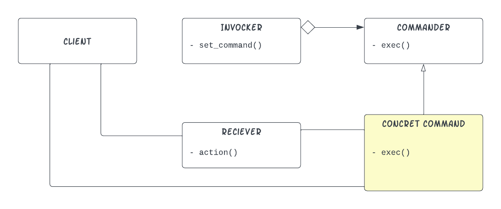

# 🌟 Reflection Black Magic 🌟

Heard of `Annotation`, `Reflection`, `Dependency Injection`, `Command Pattern` ?!, Let's put all of them into use.

## Tranditional Command Pattern

> The command pattern is a behavioral design pattern in which an object is used to encapsulate all information needed to perform an action or trigger an event at a later time ...

That's the wikipedia definition, but more intuitively when you need to decouble the need computation from the object that performs it, or more simply when you need to encapsulate method invocation from the object that owns the method.

The most OVER-used example when explaining this pattern is the Remote Controller. Here the Remote is only interested in the computation itself, in this case (_e.g. switching of the light, etc_) and it's consider good desing when decoupling the Remote from the controled devices themselves. By using the Command Pattern - in its simplest forms - the desing should follow this UML desing.

<p align="center">
     
</p>

In Code, this will look something like this.

- Reciever
```java
enum LampState { OFF, ON }

public static class LampDevice {
     private LampState state;

     public LampDevice() {
          this.state = LampState.OFF;
     }

     public void SwitchOff() {
          if (this.state == LampState.ON)
               this.state = LampState.OFF;
          this.printState();
     }

     public void SwitchOn() {
          if (this.state == LampState.OFF)
               this.state = LampState.ON;
          this.printState();
     }

     private void printState() {
          System.out.println(state);
     }
}
```
- Command
```java
public static interface Command {
     void exec();
}

public static class SwitchOnCommand implements Command {
     LampDevice device;

     public SwitchOnCommand(LampDevice device) {
          this.device = device;
     }

     @Override
     public void exec() {
          System.out.println("Switch On Command");
          this.device.SwitchOn();
     }
}

public static class SwitchOffCommand implements Command {
     LampDevice device;

     public SwitchOffCommand(LampDevice device) {
          this.device = device;
     }

     @Override
     public void exec() {
          System.out.println("Switch Off Command");
          this.device.SwitchOff();
     }
}
```
- Invoker
```java
// one single button remote, cause why not
 public static class UglyRemote {
     Command command;

     public UglyRemote(Command command) {
          this.command = command;
     }

     public void useRemote() {
          this.command.exec();
     }
}
```
Here both `SwitchOffCommand` & `SwtichOnCommand` encapsulate their actions and the `UglyRemote` does not need to know any thing about `LampDevice`. The code that will use the UglyRemote might be like this:

```java
LampDevice lamp = new LampDevice();
// Commands
Command onCommand = new SwitchOnCommand(lamp);
Command offCommand = new SwitchOffCommand(lamp);
// Remote
UglyRemote remote = new UglyRemote(onCommand);
remote.useRemote(); 
// and voilà, the light is switched on
remote.command = offCommand; // forgiveness OOP people for not using setters 🙏.
remote.useRemote(); 
// light is switched off
```

But let's say you aren't satisfied with this level of flexibility (i.e plugining commands into the remote), and you want to have concrete commands by saying _let there be a switch-off command :collision:_. Reflection augmented Dependency Injection is the way, but there are [consequences](https://en.wikipedia.org/wiki/No_free_lunch_in_search_and_optimization)!

## Black Magic 

Let's set our goals here :-
1. we want to have a system that creates remote objects dynamically at run time.
2. concrete commands shoud be instantiated at run time and correctly injected to the remote object constructor.
3. The injection shall be based on some meta data (i.e. data not necessary in the code at compile time).

> 📓 note: we will extensively use a feature in java called annotations, if you are not familiar with it [this](https://blogs.oracle.com/javamagazine/post/annotations-an-inside-look) is a good start.

`Reflection` & `Annotations` will come in handy to achive these goals. First, we will add annotations around the concrete classes in order for the reflection code to know that they are there.
```java
@Core.Command(name = "SwitchOnCommand")
public static class SwitchOnCommand implements Command {
```

```java
@Core.Command(name = "SwitchOffCommand")
public static class SwitchOffCommand implements Command {
```

and in order for the reflection code to inject these objects correctly into the Remote Object - you guessed it - we will add annotations around the parameters of the constructor with a name similar to one of the concrete classes, for example:
```java
public UglyRemote(@Core.Use(name = "SwitchOffCommand") Command command) {
```
<p align="center">

</p>


With that being added, it's now the role of the reflection code to connect these pieces together at run time. Let's assume that we have a registery of type `Hashmap<String, Class> ` where we have all the classes annotated with `@Command`. Then to create Remote Objects we could do the following :-

1. Know about the ways of creating Remote Objects, that's by calling `class.getDeclaredConstructors()`
2. Choose the one that we can inject its parameters, that's by calling `method.getParametersAnnotations()`, and make sure that these are known annotations (e.g `@Use`).
3. Get the corresponding constructor from the registry based on the `@Use.name` and append the created object into some parameters array
4. Finally, pass these parameters to the chosen constructor to create the Remote Object.
Coding these steps.

```java
Class cls = OurClassToCreate.class;
Constructor c = null;
// this for loop is to get the annotated constructor
for(var _c : cls.getDeclaredConstructors()){
    var parameter_count = _c.getParameterCount();
    var annotation_count = _c.getParameterAnnotations().length;
    if(parameter_count == annotation_count){
        c = _c;
        break;
    }
}
if(c == null) return null;
var parameter_count = c.getParameterCount();
Object params[] = new Object[parameter_count];
var parameters =  c.getParameters();
// after that we construct the needed parameters based on the class mappings in the registery
for(int i=0; i< parameter_count; i++){
    var command_annotation = parameters[i].getAnnotation(Use.class);
    Class<?> param_x_cls = this.registery.get(command_annotation.name());
    params[i] = param_x_cls.getDeclaredConstructor(LampDevice.class).newInstance(new LampDevice());
}

OurClassToCreate the_object = (OurClassToCreate) c.newInstance(params);
```
## Notes
why should we use this:
- becuase it's very safe.
```java
     public static void main(String args[]) throws NoSuchMethodException, ClassNotFoundException, IOException, URISyntaxException, InstantiationException, IllegalAccessException, IllegalArgumentException, InvocationTargetException, SecurityException {
```
- performant 😳.
```java
  private static Class<?>[] getClasses(String packageName)
               throws ClassNotFoundException, IOException, URISyntaxException {
          ...
          while (resources.hasMoreElements()) {
             ...
          }
          ArrayList<Class<?>> classes = new ArrayList<Class<?>>();
          for (File directory : dirs) {
               classes.addAll(findClasses(directory, packageName));
          }
          return classes.toArray(new Class[classes.size()]);
     }

     private static List<Class<?>> findClasses(File directory, String packageName) throws ClassNotFoundException {
          List<Class<?>> classes = new ArrayList<Class<?>>();
          if (!directory.exists()) {
               return classes;
          }
          File[] files = directory.listFiles();
          for (File file : files) {
              ...
          }
          return classes;
     }

     public void init(String pkg) throws ClassNotFoundException, IOException, URISyntaxException{
          this.registery = new HashMap<>();
          Class<?> classes[] = getClasses(pkg);
          for(var cls : classes){
               for(var annotation : cls.getAnnotations())
                    ...
          }
     }

     public <T> T getInstance(Class<T> cls) throws InstantiationException, IllegalAccessException, IllegalArgumentException, InvocationTargetException, NoSuchMethodException, SecurityException{
          Constructor c = null;
          for(var _c : cls.getDeclaredConstructors()){
               var parameter_count = _c.getParameterCount();
               var annotation_count = _c.getParameterAnnotations().length;
              ...
          }
         ...
          
          for(int i=0; i< parameter_count; i++){
              ...
          }
          return (T) c.newInstance(params);
     }
```

- But really, the main benefit is its flexabilty with which we can achieve higher levels of decoupling, but this must by in an isolated/well tested layer burried down deep in the application logic. If the other developers have to deal with reflection code quite often or it's in a higher layer of the application that is a horrible/most probably wrong desing.

## Example
👉[run/play with the code](./Main.java)👈

This example show a simple [dependency injection library](./DI_FrameWork/Core.java) that relies on a `props.txt` to dynamicly inject concrete commands into any class with annotated arguments.
